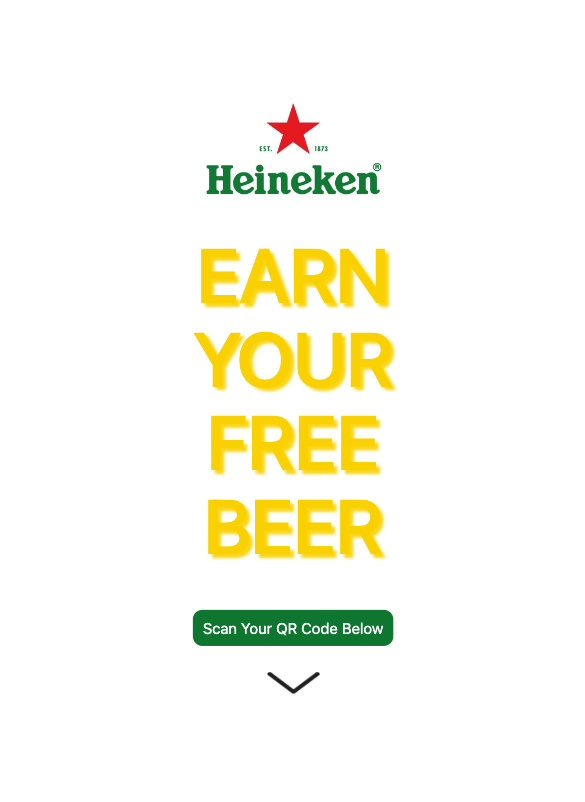
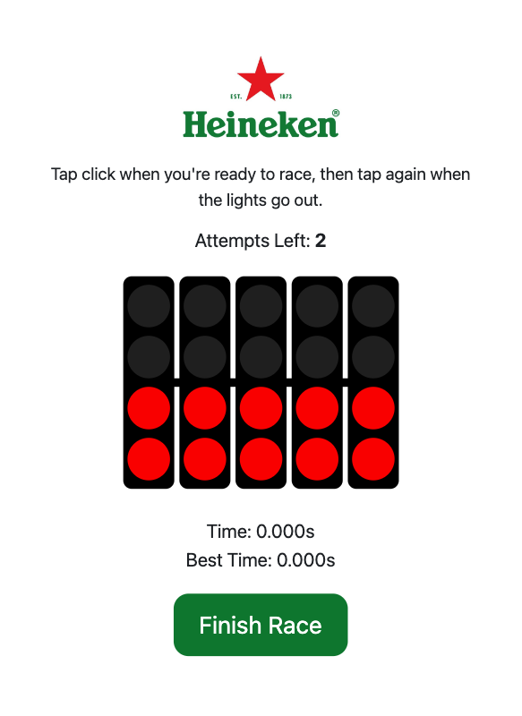
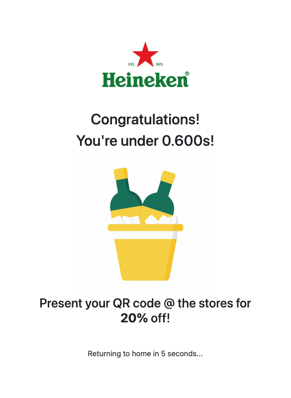
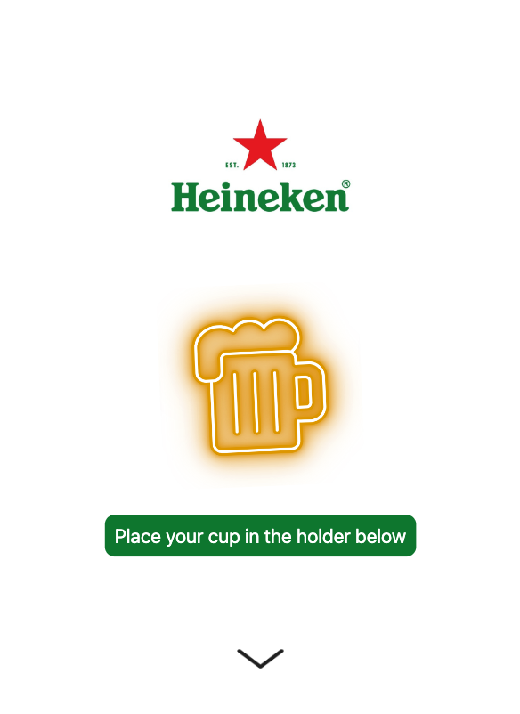
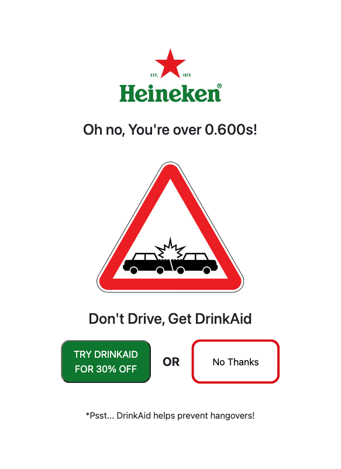
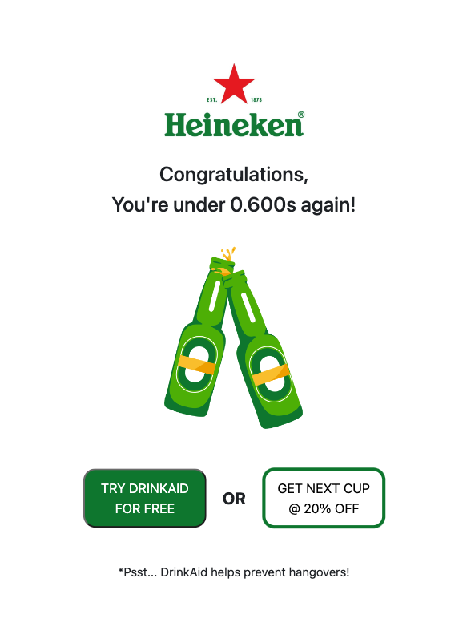
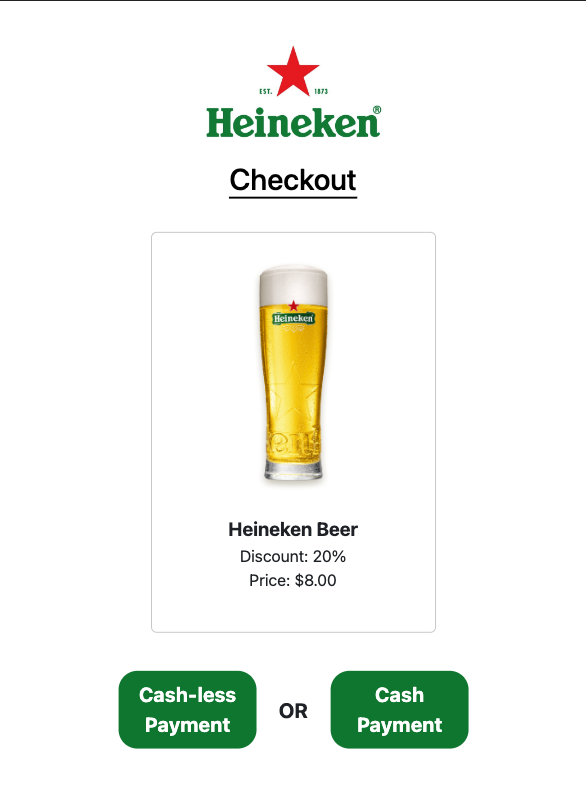
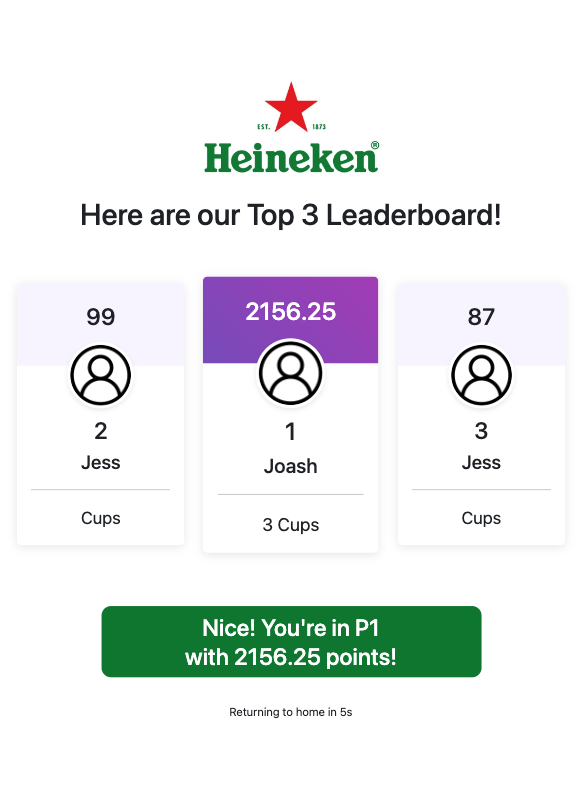

# Techducks x Heineken F1 2023

## DESCRIPTION
### Theme: Digital Empowerment

#### This marketing campaign has been developed to encourage f1-goers to enjoy their beer in a responsible way! By getting to know their limit through our fun & interactive reaction test, they wil begin to be more conscious of their drinking limits. As a result, they will become much safer when drinking!

Check out our live version & give it a try [here](https://testdriven.io/developing-a-single-page-app-with-flask-and-vuejs)!

## SETTING UP

1. Clone this project into your preferred IDE

2. Run the server-side Flask app in one terminal window:

    ```sh
    $ cd server
    $ python3 -m venv env
    $ source env/bin/activate
    (env)$ pip install -r requirements.txt
    (env)$ flask run --port=5000
    ```

    Flask Server is now running on [Port:5000](http://localhost:5173)


3. Download MongoDB as database. 

   If you are on MacOS:

   - install [Homebrew](https://brew.sh)
   - install MongoDB through this [link](https://www.mongodb.com/docs/manual/tutorial/install-mongodb-on-os-x/)

   If you are on Windows:

   - install MongoDB through this [link](https://www.mongodb.com/docs/manual/tutorial/install-mongodb-on-windows/)


4. Run the client-side Vue app in a different terminal window:

    ```sh
    $ cd client
    $ npm install
    $ npm run dev
    ```

    Navigate to [live-demo-link](https://5173-joashlaw75-techducks-htn4hymsh8o.ws-us97.gitpod.io) to begin your fun! 

   Remember to click on inspect and resize your Chrome browser to 617px * 845px to recreate the kiosk's screen.
    

# **Testing**

In this use-case, you will assume the role of an avid Heineken Beer Consumer at the F1 Singapore Grand Prix 2023! As you walk past the Heineken Booth, you see these interesting kiosks which offer you the possibility of getting some FREE beer. Thus, you design to further check it out. 

As you walk into the queue, you are approached by the heineken staff to sign up for an account with Heineken. After signing-in, you are greeted with your personalized QR code. This QR code can be personalized and be recognised as your own digital art (Will come in Phase 2 under Further-Plans for finale). For the purpose of this testing, we have generated a few QR codes which u can use to test using mock data.

Feel free to pick anyone one of the QR codes starting with the "Profile". You may find these under the project submission's screenshots section.

As you finish personalizing your stunning QR code, you look up and see that the customer before you has just walked away with a 20% off discount. It's finally your turn in the line, so you eagerly rock up to the kiosk, determined to get your discounts too!

<p align="center">
  
</p>

This is the page you'll begin your fun-filled journey with! Here, you're prompted to scan that amazing QR code at the kiosk (for this test, show it to the screen for the camera to scan instead)

As you're a new user, you'll be greeted with this F1 Themed Reaction Test!

<p align="center">
  
</p>

Are you ready to show the world your reaction time? If so, go ahead & press the green start button. When the 5 red lights go out, press finish to lock your time in. Be careful not to jump the start as you onlu have 3 attempts to ace this thing!

<p align="center">
  
</p>

If you aced it, you're good and you'll be congratulated to get your first beer @ 10% at the stores! If not, we regret that you will not be able to get any discounts on the beer today as this campaign is all about finding and staying under our limits! No worries though, you can always try again tomorrow!

Now, go on to enjoy that iced cold refreshing glass of Heineken beer! As you finish the cup, you can't wait to earn more discounts! So you are now heading back to the kiosk.

Same as before, you're greeted with the landing page & you scan your QR code. 

<p align="center">
  
</p>

But now, as you are a return user & we are trying to ensure sustainability, we would collect the cups back into the machine (For the test, do scan your profile QR code to mimic your cup being collected). Do your best @ the reaction tests again!

<p align="center">
  
</p>


If you're over >0.600s which is the road legal guide, you'll see an option to decline any more beers, or you can choose to purchase a box of DrinkAid (our partners for this campaign) which can help to reduce the side-effects of hangovers.

<p align="center">
  
</p>

If you're once again under, you've aced it champ! As a result, you can choose to reward yourself with more discounts on your next cup of Heineken Beer or choose to be wise and test out a single serving of DrinkAid for FREE!

After you've made your decision, you'll find yourself at the Check Out page where you have 2 options, Cash or Cashless Payments!

<p align="center">
  
</p>

If you choose to pay via card, click on cashless payment & tap your card on the terminal (for this test, use the QR code titled Payment to mimic payment). After payment, a screen will notify you to collecy your cup (Coming in Phase 2 of Updates)! If you choose the card, click on cash payment and proceed to the stores!

<p align="center">
  
</p>

Once payment has been successful, you'll be brought to the leaderboard page which you'll be able to see the Top 3 as well as your current position & points. 

Want to be on that leaderboard? Drink Up to earn more points but also stop before your limits to give yourself an added bonus! 

See you on the leaderboard Ace! ⭐️⭐️⭐️

## Detailed API Explanation for individual endpoints
### "store_data"
_Function: Create a user profile in the database_

##### To test "store_data" endpoint:

1. Send a POST request with valid user data and verify that the data is stored in the test database.
2. Send a POST request with existing user data and verify that the response indicates the document already exists.

### "get_qr"
_Function: Create a new QR Code for user + Fetch an existing QR code for user (if previously created)_

##### To test "get_qr" endpoint:

1. Send a POST request with a valid document ID and verify that a QR code is generated and returned.
2. Send a POST request with an invalid document ID and verify that an appropriate response is returned.

### "update_data" 
_Function: Update a user profile in the database_

##### To test "update_data" endpoint:

1. Send a POST request with a valid document ID and updated user data and verify that the data is updated in the test database.
2. Send a POST request with an invalid document ID and verify that an appropriate response is returned.

### "delete_data" 
_Function: Delete a user profile in the database_

##### To test "delete_data" endpoint:

1. Send a POST request with a valid document ID and verify that the corresponding document is deleted from the test database.
2. Send a POST request with an invalid document ID and verify that an appropriate response is returned.

### "cup_count" 
_Function: Fetch the cup count in the user's profile_

##### To test "cup_count" endpoint:

1. Send a POST request with a valid document ID and verify that the cup count is retrieved from the test database.
2. Send a POST request with an invalid document ID and verify that an appropriate response is returned.

### "cup_update" 
_Function: Fetch the cup count in the user's profile_

##### To test "cup_update" endpoint:

1. Send a POST request with a valid document ID and verify that the cup count is incremented in the test database.
2. Send a POST request with an invalid document ID and verify that an appropriate response is returned.

### "reaction_time" 
_Function: Check for pass/fail status based on reaction time_

##### To test "reaction_time" endpoint:

1. Send a POST request with a valid document ID and reaction time data and verify that the status is updated in the test database.
2. Send a POST request with an invalid document ID and verify that an appropriate response is returned.

### "bonus_chart"
_Function: Calculate total points based on cup count and reaction time_

##### To test "bonus_chart" endpoint:

1. Send a POST request with a valid document ID and verify that the bonus points are calculated correctly based on the cup count and reaction time.
2. Send a POST request with an invalid document ID and verify that an appropriate response is returned.

### "discount"
_Function: Verify if user is eligible for discount based on the cup count and pass/fail status for reaction time_

##### To test "discount" endpoint:

1. Send a POST request with a valid document ID and verify that the discount

### "check_out"
_Function: Free DrinkAid or Discounted Beer for users who have a pass status for reaction time_

##### To test "check_out" endpoint:

###### Check Out with Free Drinkaid Button:
1. Send a POST request to /checkout/<document_id> endpoint with valid document_id. 
2. Include the following JSON data in the request body:
        `{
           "button_id": "free_drinkaid_button"
         }`
3. Verify that the response JSON contains a "message" field with the value "Checked out successfully with discounted drinkaid".
4. Verify that the response status code is 200.

###### Check Out with Discounted Beer Button:
1. Send a POST request to /checkout/<document_id> endpoint with valid document_id.
2. nclude the following JSON data in the request body:
`{
  "button_id": "discount_beer_button"
}`
3. Verify that the response JSON contains a "message" field with the value "Checked out successfully with beer discount".
4. Verify that the response status code is 200.

###### Invalid Data Check Out Request:
1. Send a POST request to /checkout/<document_id> endpoint with valid document_id.
2. Include invalid or missing JSON data in the request body.
3. Verify that the response JSON contains an "error" field indicating invalid data.
4. Verify that the response status code is 400.

### "check_out_false"
_Function: Discounted DrinkAid for users who have a fail status for reaction time_

##### To test "check_out_false" endpoint:

###### Check Out with Normal Beer Button:
1. Send a POST request to /checkout/<document_id> endpoint with valid document_id. 
2. Include the following JSON data in the request body:
`{
  "button_id": "normal_beer_button"
}`
3. Verify that the response JSON contains a "message" field with the value "Checked out successfully with NO discounted beer".
4. Verify that the response status code is 200.

###### Check Out with Discounted Drinkaid Button:
1. Send a POST request to /checkout/<document_id> endpoint with valid document_id. 
2. Include the following JSON data in the request body:
`{
  "button_id": "discount_drinkaid_button"
}`
3. Verify that the response JSON contains the following fields:
   1. **"discount_percentage"** with the discount percentage value.
   2. **"final_price"** with the calculated final price.
4. Verify that the response status code is 200.

###### Invalid Data Check Out Request:
1. Send a POST request to /<document_id>/check-out-false endpoint with valid document_id.
2. Include invalid or missing JSON data in the request body.
3. Verify that the response JSON contains an "error" field indicating invalid data.
4. Verify that the response status code is 400.

### "leaderboard"
_Function: Fetch Top 3 users in the leaderboard based on total points accumulated_

##### To test "leaderboard" endpoint:

1. Send a POST request to /leaderboard endpoint.
2. Include the following JSON data in the request body:
`{
  "button_id": "top_3"
}`
3. Verify that the response JSON contains the top 3 ranked users' information, each with their respective position.
4. Verify that the response status code is 200.

### "leaderboard_personal"
_Function: Fetch user's position in the leaderboard based on total points accumulated_

##### To test "leaderboard_personal" endpoint:

1. Send a POST request to /leaderboard/<document_id> endpoint with valid document_id.
2. Verify that the response JSON contains a "user_rank" field with the user's rank in the leaderboard.
3. Verify that the response status code is 200.

## AUTHORS AND ACKNOWLEDGEMENT
_This Python project is created by **@JoashLaw75** and **@jiaxuane** in collaboration._


## LICENSE

[MIT](https://choosealicense.com/licenses/mit/)